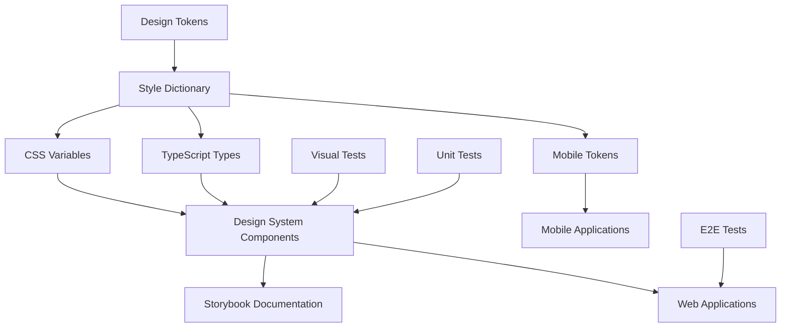

# 🎨 Mimic: Design-Token-Driven Development Pipeline

[](https://github.com/IAmJonoBo/mimic/actions)
[](https://opensource.org/licenses/MIT)
[](https://nx.dev)
[](https://www.typescriptlang.org/)

> A modern, collision-free design token management platform using 100% libre tooling for building scalable\
> design systems and multi-platform applications with comprehensive collision prevention architecture.

## 🌟 Overview

Mimic is a comprehensive monorepo that demonstrates how to build a complete design system pipeline using only
open-source tools. It provides a seamless workflow from design tokens to production-ready components across multiple
platforms.

### ✨ Key Features

- 🎯 **Single Source of Truth**: Design tokens managed with W3C-DTCG standards
- 🚀 **Multi-Platform**: Web, mobile, and desktop from one codebase
- 🔧 **Modern Tooling**: Nx 21, TypeScript 5.8, Vite, Storybook 8
- 🧹 **Zero Lock-in**: 100% open-source, self-hostable
- ⚡ **Developer Experience**: Hot reload, visual testing, automated workflows
- 🔒 **Enterprise Ready**: Type-safe, tested, documented
- 🛡️ **Collision-Free Architecture**: Comprehensive namespace strategy prevents all conflicts

## 🏗️ Architecture



## Executive Summary

Mimic provides a comprehensive, collision-free design token management platform using 100% open-source tools.
We self-host Penpot v2 for design, export W3C-DTCG compliant JSON tokens, transform them with Style Dictionary using
our industry-leading collision-prevention architecture, and deploy to multiple platforms: Qwik City (web),
React Native (mobile), Tauri (desktop), and Compose Multiplatform. Automated visual, unit, and interaction tests
gate every pull request. All components are MIT, Apache-2.0, or AGPL—enabling fully on-premises deployment.

## Project Objectives

1. **Single source of visual truth:** Design tokens mastered in Penpot and version-controlled.
2. **Write once, run everywhere:** The same primitives render on web, iOS, Android, desktop, and WebAssembly.
3. **No vendor lock-in:** Only FOSS licenses; everything can be air-gapped.
4. **Shift-left quality:** Visual/interaction tests break builds, not production.
5. **AI-assisted velocity:** Deterministic scaffolding that never violates the design system.

## Technical Stack

### Design & Token Pipeline

| Element         | Tool                  | Rationale                                                   |
| --------------- | --------------------- | ----------------------------------------------------------- |
| Design canvas   | Penpot v2             | Self-hosted, collaborative, AGPL, native design-token panel |
| Format spec     | W3C-DTCG JSON         | Inter-tool standard for tokens                              |
| Token transform | Style Dictionary v4.x | Multi-platform token generation with collision prevention   |

### Web & Documentation

| Concern    | Tool            | Notes                                  |
| ---------- | --------------- | -------------------------------------- |
| Framework  | Qwik City 2.x   | <1 kB hydration, resumability          |
| Styling    | vanilla-extract | Zero-runtime CSS, type-safe            |
| Docs/tests | Storybook 8.5+  | Built-in axe checks, visual regression |

### Multi-Platform Runtimes

| Target                   | Framework                  | Token Integration                   |
| ------------------------ | -------------------------- | ----------------------------------- |
| Android/iOS/Desktop/Wasm | Compose Multiplatform 1.7  | Theme.kt auto-generated from tokens |
| Mobile JS reuse          | React Native 0.80 + Hermes | tokens.ts; New Architecture + IPO   |
| Desktop                  | Tauri 2.x                  | Web tokens + native performance     |

## 🚀 Quick Start

### Prerequisites

- **Node.js**: 20.0.0 LTS or later with corepack enabled
- **pnpm**: 8.0.0 or later (install via `corepack enable`)
- **Git**: For version control
- **Docker**: For Penpot export automation (optional)
- **Rust & Cargo**: For Tauri desktop builds (optional)
- **JDK 17 / Android SDK / Xcode**: For native mobile builds (optional)

### Installation & Bootstrap

```bash
# Clone the repository
git clone https://github.com/IAmJonoBo/mimic.git
cd mimic

# Install dependencies
pnpm install

# Set up environment (optional - for Penpot integration)
cp .env.example .env
# Edit .env with your Penpot credentials

# Build design tokens and all packages
make tokens-build  # or: pnpm nx run tokens:build-all

# Start full development environment
make dev          # or: pnpm nx run dev:full-stack
```

### Essential Commands

#### Design Token Workflow

```bash
# � Export tokens from Penpot and build all outputs
make tokens-sync    # Requires .env configuration

# 👀 Watch tokens and rebuild on changes
make tokens-watch

# � Build design tokens only
make tokens-build
```

#### Development Environment

```bash
# 🚀 Start complete development environment (tokens + Storybook)
make dev

# 📚 Start Storybook component workshop
make storybook

# � Start web application development (when implemented)
make web-dev
```

#### Testing & Quality

````bash
# 🧪 Run all tests and linting
make test

# 👀 Run visual regression tests
make visual-test

# 🔍 Run tests for affected projects only
make test-affected

# 🧹 Clean workspace
pnpm clean:all

# 📊 View dependency graph
pnpm graph
```bash

## 📦 Package Structure

This monorepo contains the following packages:

### 🎨 [`packages/design-tokens`](./packages/design-tokens)

W3C-compliant design tokens with Style Dictionary transformation

- Token definitions in JSON format
- CSS variables generation
- TypeScript type definitions
- Multi-platform token exports

### 🧩 [`packages/design-system`](./packages/design-system)

React component library with Storybook documentation

- Reusable UI components
- Storybook stories and documentation
- Visual regression testing
- Accessibility testing

### 🔧 [`packages/shared-utils`](./packages/shared-utils)

Shared utilities and helper functions

- Cross-platform utilities
- Common TypeScript types
- Helper functions

## 🛠️ Technology Stack

### Core Technologies

| Category            | Technology                               | Version | Purpose                                       |
| ------------------- | ---------------------------------------- | ------- | --------------------------------------------- |
| **Monorepo**        | [Nx](https://nx.dev)                     | 21.2.1  | Task orchestration, caching, code generation  |
| **Package Manager** | [pnpm](https://pnpm.io)                  | 9.0.0   | Fast, disk-space efficient package management |
| **Language**        | [TypeScript](https://typescriptlang.org) | 5.8.3   | Type-safe JavaScript development              |
| **Build Tool**      | [Vite](https://vitejs.dev)               | 5.x     | Fast builds and hot module replacement        |

### Design System

| Tool                 | Purpose                             |
| -------------------- | ----------------------------------- |
| **Style Dictionary** | Design token transformation         |
| **Storybook**        | Component documentation and testing |
| **React**            | Component library framework         |

### Quality Assurance

| Tool         | Purpose                     |
| ------------ | --------------------------- |
| **Vitest**   | Unit testing framework      |
| **ESLint**   | Code linting and formatting |
| **Prettier** | Code formatting             |
| **Husky**    | Git hooks for quality gates |

## 🎯 Project Goals

### Primary Objectives

1. **🎨 Single Source of Truth**: Design tokens managed with W3C DTCG standards
2. **🚀 Multi-Platform Compatibility**: Write once, deploy everywhere
3. **🔒 Zero Vendor Lock-in**: 100% open-source, self-hostable
4. **⚡ Developer Experience**: Modern tooling with hot reload and automation
5. **🛡️ Quality First**: Automated testing and visual regression detection

### Technical Vision

- **Token-Driven Development**: All visual properties derived from centralized tokens
- **Component Reusability**: Shared components across web, mobile, and desktop
- **Automated Quality Gates**: No manual testing bottlenecks
- **Developer Productivity**: Fast builds, intelligent caching, and helpful tooling
- **Collision-Free Architecture**: Comprehensive namespace strategy prevents all conflicts

## 🎯 Performance Targets

### Quality Metrics

- **Build Time**: < 5 minutes for full pipeline
- **Bundle Size**: Within defined budgets per platform
- **Load Time**: < 3 seconds for all applications
- **Test Coverage**: > 80% across all platforms
- **Zero Critical Vulnerabilities**: Automated security scanning

### User Experience Metrics

- **Token Update Speed**: < 5 minutes from design to development
- **Developer Onboarding**: < 30 minutes to first contribution
- **Build Success Rate**: > 95% successful builds
- **Core Web Vitals**: LCP < 2s on 3G, CLS < 0.1

## 📚 Documentation

## 📚 Documentation

### Core Documentation

- **[📋 User Guide](./docs/USER_GUIDE.md)** - Complete step-by-step guide for designers, developers, and DevOps
- **[🎛️ Control Document](./docs/CONTROL_DOCUMENT.md)** - Master technical reference and operational procedures
- **[� Documentation Index](./docs/README.md)** - Complete documentation overview

### Quick References

- **[🚀 Quick Start Guide](#-quick-start)** - Get up and running in minutes
- **[🤝 Contributing Guide](./CONTRIBUTING.md)** - How to contribute to the project
- **[🛠️ Development Guide](./DEVELOPMENT.md)** - Local development workflows
- **[📖 API Reference](./docs/API.md)** - Complete API documentation
- **[🏗️ Architecture Decisions](./docs/ADR.md)** - Technical decision records
- **[🔧 Troubleshooting](./docs/TROUBLESHOOTING.md)** - Common issues and solutions

### Package Documentation

- **[🎨 Design Tokens](./packages/design-tokens/README.md)** - W3C-compliant design tokens
- **[🧩 Design System](./packages/design-system/README.md)** - Qwik component library
- **[🔧 Shared Utilities](./packages/shared-utils/README.md)** - Common helper functions

### Live Documentation

- **[📚 Storybook](https://iamjonobo.github.io/mimic/storybook/)** - Interactive component playground
- **[📊 Dependency Graph](https://nx.dev/packages/nx/documents/dep-graph)** - Project dependency visualization

## 🛡️ Collision Prevention Architecture

Mimic implements a comprehensive collision-prevention strategy that eliminates all four types of conflicts:
naming collisions, file-path collisions, module boundary violations, and runtime global conflicts.

### Core Principles

1. **Universal Namespace Strategy**: All tokens use the `ds-` prefix across all platforms
2. **Platform-Rooted Build Paths**: Each platform outputs to isolated directories
3. **Module Boundary Enforcement**: Nx rules prevent illegal cross-platform imports
4. **Runtime Isolation**: Platform-specific global scoping prevents conflicts
5. **Tailwind CSS Compatibility**: `ds-` prefix prevents utility class conflicts per Specify/Locofy warnings
6. **Metro Deduplication**: Scoped package names (`@mimic/design-tokens`) prevent React Native bundle duplication per
Locofy FAQ
7. **Storybook Port Management**: Fixed ports (Web:6006, Mobile:7007, Desktop:6008) prevent dev-machine conflicts per
Supernova docs

### Token Namespace Strategy

| Platform                  | Prefix Format      | Example Output               |
| ------------------------- | ------------------ | ---------------------------- |
| **CSS/SCSS**              | `ds-` (kebab-case) | `--ds-color-primary-500`     |
| **JavaScript/TypeScript** | `ds` (camelCase)   | `dsColorPrimary500`          |
| **Kotlin/Compose**        | `Ds` (PascalCase)  | `DsTokens.Color.PRIMARY_500` |
| **React Native**          | `ds` (camelCase)   | `dsColorPrimary500`          |

### Platform-Rooted Build Paths

```text
packages/design-tokens/libs/tokens/
├── css/tokens.css           # Web CSS variables
├── js/tokens.js             # Web JavaScript constants
├── ts/tokens.ts             # Web TypeScript types
├── compose/Theme.kt         # Compose Multiplatform objects
└── react-native/theme.ts    # React Native StyleSheet
```

### Critical Collision Prevention Details

**1. Token-Name Clashes (Specify/Tailwind Warning)**
Mimic's `ds-` prefix strategy completely prevents Specify-documented collisions with Tailwind classes:
- `--ds-color-primary` ≠ `.text-primary` (no conflict)
- `--ds-spacing-md` ≠ `.p-4` or `.m-4` (no conflict)
- `dsColorPrimary` ≠ Tailwind utility functions (no conflict)

**2. Storybook Port Conflicts (Supernova Issue)**
Fixed port assignment prevents Supernova-documented development machine conflicts:
- **Web Storybook**: Port 6006 (Vite builder default)
- **Mobile Storybook**: Port 7007 (React Native builder default)
- **Desktop Storybook**: Port 6008 (Vite builder custom)

**3. Metro Bundle Duplication (Locofy FAQ)**
Scoped package naming prevents Locofy-documented Metro workspace lib collisions:
- Package name: `"@mimic/design-tokens"` (scoped, not `design-tokens`)
- Metro recognizes scoped names and deduplicates correctly
- Workspace lib names cannot conflict with external package names

📖 **Further reading**: [User Guide](./docs/USER_GUIDE.md#collision-prevention-architecture) • [Control Document](./docs/CONTROL_DOCUMENT.md#collision-prevention-architecture)

## 🤝 Contributing

We welcome contributions! Please see our [Contributing Guide](./CONTRIBUTING.md) for details.

### Development Workflow

1. **Fork** the repository
2. **Create** a feature branch (`git checkout -b feature/amazing-feature`)
3. **Commit** your changes (`git commit -m 'Add amazing feature'`)
4. **Push** to the branch (`git push origin feature/amazing-feature`)
5. **Open** a Pull Request

### Code Quality

All contributions must pass:

- ✅ Type checking with TypeScript
- ✅ Linting with ESLint
- ✅ Unit tests with Vitest
- ✅ Visual regression tests
- ✅ Build verification

## 📄 License

This project is licensed under the MIT License - see the [LICENSE](LICENSE) file for details.

## 🔗 Links

- **Repository**: [https://github.com/IAmJonoBo/mimic](https://github.com/IAmJonoBo/mimic)
- **Issues**: [Report bugs or request features](https://github.com/IAmJonoBo/mimic/issues)
- **Discussions**: [Join the conversation](https://github.com/IAmJonoBo/mimic/discussions)

---

Built with ❤️ using 100% open-source tools

[Nx](https://nx.dev) • [TypeScript](https://typescriptlang.org) • [Vite](https://vitejs.dev) • [Storybook](https://storybook.js.org)
| Platform | Nx/Turborepo config, Docker dev-containers |
| Dev Rel | Docs site, public Storybook, community contrib |

## Quality Metrics

- Core Web Vitals: LCP < 2s on 3G, CLS < 0.1
- Binary size: Tauri ≤ 5 MB zipped; RN APK ≤ 30 MB
- Visual diff budget: 0 px delta acceptance; approved golden updates via PR
- Test coverage: ≥ 90% lines in shared libraries

## Risk & Mitigation

| Risk               | Mitigation                                  |
| ------------------ | ------------------------------------------- |
| Framework churn    | Lock semver ranges; monthly review          |
| Penpot API changes | Pin to stable Docker tag; integration tests |
| LLM hallucination  | Token constants enforce compile-time checks |
| Build time creep   | Nx remote cache + turborepo incremental     |

## Acceptance Criteria

- Single command `pnpm nx affected -t=build` recompiles only touched packages.
- Any token change propagates automatically to Qwik, RN, Compose builds.
- CI must fail if Storybook test-runner or Loki reports errors.
- Desktop app build (`cargo tauri build --release`) ≤ 5 MB zip.
- Developer onboarding < 30 minutes with Dev Container.

## Key Advantages

1. Licence-free: Penpot AGPL; all runtime code MIT/Apache.
2. Token-first: one JSON drives every renderer.
3. Performance: Qwik’s <1 kB hydration and Hermes IPO keep bundles lean.
4. Quality gates: Playwright, Loki, Vitest stop regressions pre-merge.
5. Local AI: Llama 3 improves velocity without sending IP to the cloud.

---

## 📚 Documentation Roadmap

| Document | Purpose | Audience |
|----------|---------|----------|
| **[README](./README.md)** | Project overview, quick start, architecture summary | All stakeholders |
| **[User Guide](./docs/USER_GUIDE.md)** | Step-by-step tutorials and workflows | Designers, Developers, DevOps |
| **[Control Document](./docs/CONTROL_DOCUMENT.md)** | Technical reference and operational procedures | Technical Teams, DevOps |
| **[Contributing Guide](./CONTRIBUTING.md)** | Development workflows and coding standards | Contributors |
````
