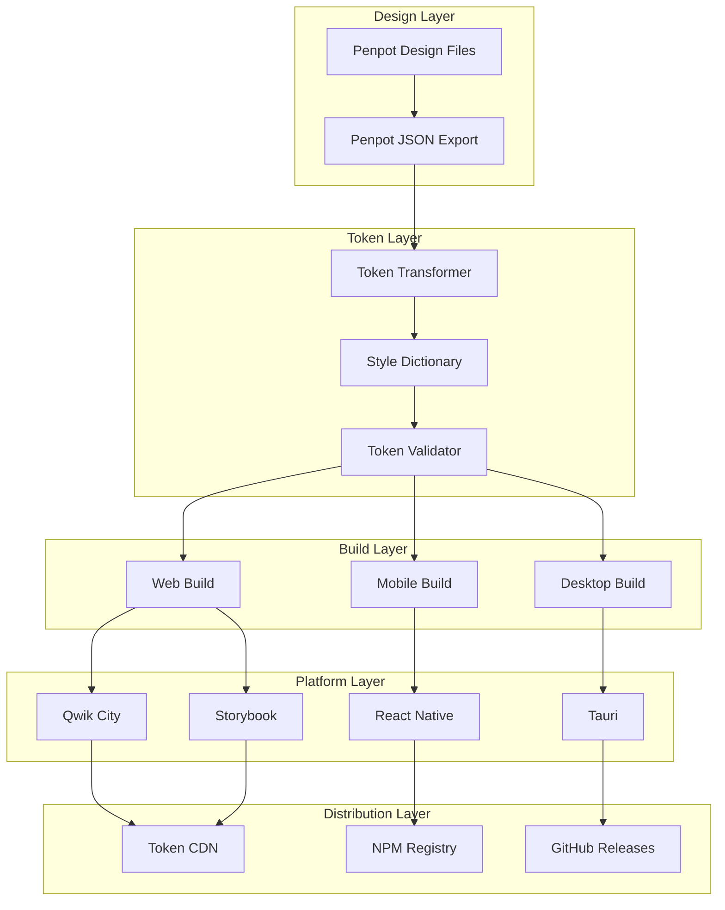

# Mimic Design Token Pipeline: Master Control Document

**Version**: 2.0.0  
**Last Updated**: December 2024  
**Status**: Production Ready

This document serves as the canonical reference and control handbook for the complete Mimic design
token pipeline. It orchestrates all components, workflows, and integrations across the entire ecosystem.

## Executive Summary

Mimic is a comprehensive, open-source design token management platform that provides real-time
synchronization between design tools (Penpot), transformation systems (Style Dictionary), and
platform-specific outputs (Qwik, React Native, Tauri). This control document defines the complete
architecture, workflows, and operational procedures for the entire pipeline.

## Architecture Overview

### Core Pipeline Components



### System Architecture Principles

1. **Deterministic**: Every build produces identical results given the same inputs
2. **Platform-Agnostic**: Tokens work consistently across all supported platforms
3. **Type-Safe**: Full TypeScript support with generated type definitions
4. **Performance-First**: Optimized for both build-time and runtime performance
5. **Developer-Friendly**: Comprehensive tooling, documentation, and debugging support
6. **Production-Ready**: Enterprise-grade security, monitoring, and deployment processes

## Pipeline Control Flow

### 1. Design Token Lifecycle

```typescript
interface TokenLifecycle {
  // 1. Design Phase
  design: {
    tool: 'Penpot';
    format: 'Penpot JSON';
    validation: 'Schema Compliance';
  };
  
  // 2. Transformation Phase
  transform: {
    tool: 'Style Dictionary';
    config: 'Multi-Platform';
    outputs: ['CSS', 'JS', 'JSON', 'Kotlin', 'Swift', 'Rust'];
  };
  
  // 3. Validation Phase
  validate: {
    schema: boolean;
    semantics: boolean;
    accessibility: boolean;
    performance: boolean;
  };
  
  // 4. Distribution Phase
  distribute: {
    web: 'Qwik City + Storybook';
    mobile: 'React Native (iOS/Android)';
    desktop: 'Tauri (Windows/macOS/Linux)';
  };
  
  // 5. Deployment Phase
  deploy: {
    staging: 'Automated';
    production: 'Gated';
    rollback: 'Immediate';
  };
}
```

### 2. Critical Workflows

#### Design Token Update Workflow

1. **Design Phase** (Penpot)
   - Designer updates tokens in Penpot
   - Export validated Penpot JSON
   - Automatic schema validation

2. **Transform Phase** (Style Dictionary)
   - Parse Penpot JSON format
   - Apply platform-specific transforms
   - Generate type-safe outputs

3. **Validation Phase** (Automated)
   - Schema compliance check
   - Semantic validation (contrast, spacing)
   - Performance impact analysis

4. **Integration Phase** (CI/CD)
   - Automated builds across platforms
   - Visual regression testing
   - Performance budget validation

5. **Deployment Phase** (Automated)
   - Staging deployment for validation
   - Production deployment with rollback
   - Real-time monitoring and alerts

## Technical Implementation Guide

### Core Technologies Stack

| Layer | Technology | Version | Purpose |
|-------|------------|---------|---------|
| **Design** | Penpot | Latest | Design tool integration |
| **Transform** | Style Dictionary | 4.x | Token transformation |
| **Web** | Qwik City | 1.x | Web application framework |
| **Mobile** | React Native | 0.73+ | Mobile application platform |
| **Desktop** | Tauri | 2.x | Desktop application framework |
| **Testing** | Storybook | 8.5+ | Component testing & documentation |
| **CI/CD** | GitHub Actions | Latest | Automated pipeline orchestration |
| **Language** | TypeScript | 5.x | Primary development language |

### Platform-Specific Configurations

#### Web Platform (Qwik City)

```json
{
  "framework": "Qwik City",
  "bundler": "Vite",
  "features": [
    "SSR/SSG support",
    "Image optimization",
    "Performance budgets",
    "Bundle splitting"
  ],
  "tokenFormats": ["CSS Custom Properties", "JavaScript", "TypeScript"],
  "deployment": "Vercel/Netlify/Cloudflare"
}
```

#### Mobile Platform (React Native)

```json
{
  "framework": "React Native",
  "architecture": "New Architecture (Fabric + TurboModules)",
  "features": [
    "Hermes engine optimization",
    "Native module integration",
    "Platform-specific theming",
    "Performance monitoring"
  ],
  "tokenFormats": ["JavaScript", "JSON", "Native (iOS/Android)"],
  "deployment": "App Store / Play Store"
}
```

#### Desktop Platform (Tauri)

```json
{
  "framework": "Tauri",
  "backend": "Rust",
  "features": [
    "Code signing & notarization",
    "Auto-updater with verification",
    "Security hardening",
    "Cross-platform builds"
  ],
  "tokenFormats": ["CSS", "JavaScript", "Rust"],
  "deployment": "GitHub Releases / Microsoft Store / Homebrew"
}
```

## Quality Assurance Framework

### Testing Strategy

#### 1. Unit Testing

- **Token Transformation**: Validate all Style Dictionary transforms
- **Component Logic**: Test all UI component functionality
- **Utility Functions**: Ensure helper functions work correctly

#### 2. Integration Testing

- **Cross-Platform**: Validate tokens work across all platforms
- **API Integration**: Test Penpot JSON parsing and export
- **Build Pipeline**: Ensure builds complete successfully

#### 3. Visual Testing

- **Storybook Integration**: Automated visual regression testing
- **Cross-Browser**: Validate appearance across browsers
- **Responsive Design**: Test across device sizes

#### 4. Performance Testing

- **Bundle Size**: Monitor and enforce size budgets
- **Load Times**: Validate Core Web Vitals compliance
- **Memory Usage**: Monitor resource consumption

### Quality Gates

#### Commit-Level Gates

- [ ] Linting (ESLint, Prettier, Clippy)
- [ ] Type checking (TypeScript, Rust)
- [ ] Unit tests pass
- [ ] Security scanning

#### Pull Request Gates

- [ ] Integration tests pass
- [ ] Visual regression tests pass
- [ ] Performance budgets met
- [ ] Documentation updated
- [ ] Code review approved

#### Release Gates

- [ ] All tests pass across platforms
- [ ] Security audit clean
- [ ] Performance benchmarks met
- [ ] Documentation complete
- [ ] Staging validation successful

## Security & Compliance

### Security Measures

#### Design Token Security

- **Encryption at Rest**: Sensitive tokens encrypted
- **Access Control**: Role-based access to token management
- **Audit Trail**: Complete change history tracking
- **Validation**: Schema and content validation

#### Application Security

- **Code Signing**: All releases digitally signed
- **Dependency Scanning**: Regular vulnerability assessments
- **CSP Implementation**: Content Security Policy enforcement
- **Update Security**: Secure auto-update mechanisms

#### Data Protection

- **Privacy by Design**: No personal data collection
- **GDPR Compliance**: Data handling compliance
- **Secure Communication**: Encrypted data transmission
- **Backup & Recovery**: Secure backup procedures

### Compliance Framework

#### Accessibility Compliance

- **WCAG 2.1 AA**: Full compliance validation
- **Screen Reader**: Compatible with assistive technologies
- **Keyboard Navigation**: Full keyboard accessibility
- **Color Contrast**: Automated contrast checking

#### Performance Compliance

- **Core Web Vitals**: Meet Google's performance standards
- **Bundle Size**: Enforce strict size limits
- **Load Times**: Sub-3-second load time targets
- **Mobile Performance**: Optimized for mobile devices

## Operational Procedures

### Deployment Process

#### Staging Deployment

1. **Automated Triggers**: Push to develop branch
2. **Build Validation**: All platforms build successfully
3. **Quality Gates**: All tests pass
4. **Staging Deploy**: Automatic deployment to staging
5. **Smoke Tests**: Basic functionality validation

#### Production Deployment

1. **Manual Trigger**: Release tag creation
2. **Security Scan**: Final security validation
3. **Performance Check**: Final performance validation
4. **Blue-Green Deploy**: Zero-downtime deployment
5. **Health Checks**: Post-deployment validation
6. **Rollback Ready**: Immediate rollback capability

### Monitoring & Alerting

#### System Monitoring

- **Uptime Monitoring**: 99.9% availability target
- **Performance Monitoring**: Real-time performance tracking
- **Error Tracking**: Comprehensive error logging
- **Usage Analytics**: Platform adoption metrics

#### Alert Configuration

- **Critical Alerts**: Immediate notification (< 5 minutes)
- **Warning Alerts**: Standard notification (< 30 minutes)
- **Info Alerts**: Batch notification (daily digest)
- **Escalation**: Automatic escalation procedures

### Incident Response

#### Incident Classification

- **P0 (Critical)**: Complete system outage
- **P1 (High)**: Major feature degradation
- **P2 (Medium)**: Minor feature issues
- **P3 (Low)**: Cosmetic or documentation issues

#### Response Procedures

1. **Detection**: Automated monitoring alerts
2. **Assessment**: Incident severity classification
3. **Response**: Appropriate team activation
4. **Communication**: Stakeholder notification
5. **Resolution**: Issue remediation
6. **Post-Mortem**: Learning and improvement

## Documentation Architecture

### Documentation Categories

#### Developer Documentation

- [Getting Started Guide](./onboarding/README.md)
- [Advanced Developer Guide](./onboarding/advanced-contributor-guide.md)
- [API Reference](./api/README.md)
- [Platform Integration Guides](./platforms/README.md)

#### Design Documentation

- [Penpot Integration](./design/penpot-integration.md)
- [Token Schema Documentation](./design/penpot-token-schema.md)
- [Design System Guidelines](./design/README.md)

#### Technical Documentation

- [Architecture Overview](./architecture/README.md)
- [Build System Documentation](./build/README.md)
- [CI/CD Pipeline Guide](./cicd/README.md)
- [Security Framework](./security/README.md)

#### Platform-Specific Documentation

- [Web Platform (Qwik)](./web/README.md)
- [Mobile Platform (React Native)](./mobile/README.md)
- [Desktop Platform (Tauri)](./desktop/README.md)
- [Storybook Integration](./platforms/storybook.md)

### Documentation Standards

#### Content Standards

- **Clarity**: Clear, concise, and actionable content
- **Completeness**: Comprehensive coverage of all features
- **Currency**: Regular updates and maintenance
- **Accessibility**: Accessible to developers of all skill levels

#### Technical Standards

- **Markdown**: Primary format for all documentation
- **Code Examples**: Working, tested code samples
- **Diagrams**: Visual representations using Mermaid
- **Cross-References**: Internal linking for discoverability

## Project Governance

### Contribution Guidelines

#### Code Contributions

1. **Fork & Branch**: Create feature branches from main
2. **Development**: Follow coding standards and conventions
3. **Testing**: Add tests for new functionality
4. **Documentation**: Update relevant documentation
5. **Pull Request**: Submit for review with clear description
6. **Review**: Code review and approval process
7. **Merge**: Squash and merge after approval

#### Documentation Contributions

1. **Issue Creation**: Document improvement needs
2. **Draft Creation**: Write initial documentation draft
3. **Review Process**: Technical and editorial review
4. **Validation**: Test documentation accuracy
5. **Publication**: Merge and deploy updates

### Maintenance Schedule

#### Regular Maintenance

- **Weekly**: Dependency updates and security scans
- **Monthly**: Performance reviews and optimization
- **Quarterly**: Comprehensive system audits
- **Annually**: Major version planning and release

#### Emergency Maintenance

- **Security Issues**: Immediate patching and deployment
- **Critical Bugs**: Same-day resolution target
- **Performance Issues**: 48-hour resolution target
- **Documentation Issues**: 1-week resolution target

## Success Metrics

### Technical Metrics

#### Performance Metrics

- **Build Time**: < 5 minutes for full pipeline
- **Bundle Size**: Within defined budgets per platform
- **Load Time**: < 3 seconds for all applications
- **Uptime**: 99.9% availability target

#### Quality Metrics

- **Test Coverage**: > 80% across all platforms
- **Bug Rate**: < 5 bugs per 1000 lines of code
- **Security Issues**: Zero critical vulnerabilities
- **Documentation Coverage**: 100% API documentation

### User Experience Metrics

#### Developer Experience

- **Onboarding Time**: < 30 minutes to first contribution
- **Build Success Rate**: > 95% successful builds
- **Developer Satisfaction**: > 4.5/5 in surveys
- **Community Growth**: Measured by contributions

#### Design Experience

- **Token Update Speed**: < 5 minutes from design to development
- **Design Consistency**: Automated consistency validation
- **Designer Satisfaction**: > 4.5/5 in surveys
- **Adoption Rate**: Platform usage metrics

## Future Roadmap

### Short-Term Goals (3 months)

- [ ] Complete documentation coverage at 100%
- [ ] Achieve full platform parity for all token formats
- [ ] Implement advanced performance monitoring
- [ ] Establish comprehensive security scanning

### Medium-Term Goals (6 months)

- [ ] Add support for additional design tools
- [ ] Implement advanced theming capabilities
- [ ] Expand platform support (Flutter, Vue, etc.)
- [ ] Develop advanced developer tooling

### Long-Term Goals (12 months)

- [ ] Enterprise features and support
- [ ] Advanced analytics and insights
- [ ] Marketplace for token themes
- [ ] AI-powered design token optimization

## Conclusion

This control document establishes the foundation for a world-class design token management platform.
By following these guidelines, procedures, and standards, the Mimic platform delivers consistent,
reliable, and performant design token management across all supported platforms.

The platform's success depends on maintaining these standards while continuously improving the
developer and designer experience. Regular reviews and updates to this control document ensure
the platform evolves with the needs of its users and the broader design and development community.

---

**Document Control**

- **Owner**: Mimic Core Team
- **Review Cycle**: Quarterly
- **Next Review**: March 2025
- **Distribution**: Public (Open Source)
- **Classification**: Documentation
