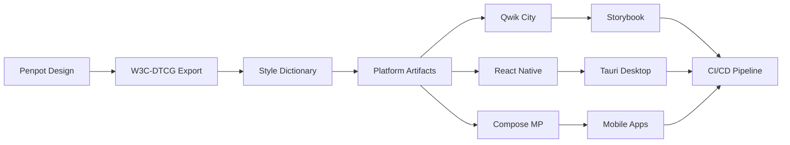

# Mimic Design Token Pipeline: User Guide

**Version**: 2.0.0  
**Last Updated**: June 2025  
**Target Audience**: Designers, Developers, DevOps Engineers

Building on everything we've planned, this User Guide walks you—designer, developer, or DevOps—through
each stage of the open-source pipeline, explains why the step matters, and links straight to the official docs for
deeper dives. Follow it in order the first time; afterwards you can jump to any section as a reference.

## Overview

We start in Penpot, export W3C-DTCG tokens, transform them with Style Dictionary, and consume the
generated artefacts in Qwik City (web), Compose Multiplatform and React Native (mobile/desktop).
Components are documented and tested in Storybook 8, packaged for the desktop with Tauri 2, and
guarded by Nx-driven CI gates. Each stage is 100% open-source and self-hostable.



---

## 1. Prerequisites

| Tool                             | Version       | Purpose                                     |
| -------------------------------- | ------------- | ------------------------------------------- |
| **Node 20 LTS + pnpm 8**         | Latest LTS    | JS runtimes, monorepo PM                    |
| **Rust & Cargo**                 | Latest stable | Tauri CLI builds                            |
| **JDK 17 / Android SDK / Xcode** | Latest        | Compose MP & RN native targets              |
| **Docker (optional)**            | Latest        | Dev-container with Penpot, Postgres, Ollama |

### Quick Setup

Install Node via corepack, then initialize the repo:

```bash
# Enable corepack for pnpm
corepack enable

# Create Nx workspace
pnpm dlx create-nx-workspace@latest mimic-tokens --preset=empty

# Navigate to workspace
cd mimic-tokens

# Install dependencies
pnpm install
```

**Why this matters**: A consistent toolchain ensures reproducible builds across all team
members and CI environments. The Nx monorepo structure provides dependency graph management and
efficient task execution.

📖 **Further reading**: [Nx Getting Started Guide](https://nx.dev/getting-started)

---

## 2. Design in Penpot

### 2.1 Create and Organize Tokens

1. **Create global/alias/semantic tokens** in the Tokens panel

   - Global tokens: Raw values (colors, spacing, typography)
   - Alias tokens: References to global tokens with semantic meaning
   - Component tokens: Context-specific overrides

2. **Export tokens** using one of these methods:

**Menu Export** (Recommended for beginners):

- Go to **Tokens → Export** in Penpot interface
- Select W3C-DTCG JSON format
- Download `tokens.json`

**CLI Export** (Recommended for automation):

```bash
npx penpot-export --file <penpot-file-uuid> --out tokens.json
```

The CLI outputs W3C-JSON plus optional SVG/PNG assets for icons and illustrations.

### 2.2 Version Control Integration

1. **Commit `design/tokens.json` to Git**; a pre-commit hook automatically rejects manual
   edits to ensure design tool remains the source of truth.

2. **(Optional) Add export presets** to icons/illustrations so the same CLI also outputs
   optimized assets for the web bundle.

**Why this matters**: Penpot provides the single source of truth for design decisions.
The W3C-DTCG format ensures interoperability with any standards-compliant token system.

📖 **Further reading**:

- [Penpot User Guide](https://help.penpot.app/)
- [W3C Design Tokens Spec](https://design-tokens.github.io/community-group/format/)
- [Penpot Token Schema](./design/penpot-token-schema.md)

---

## 3. Transform Tokens with Style Dictionary

### 3.1 Setup and Configuration

```bash
# Install Style Dictionary
pnpm add -w -D style-dictionary

# Initialize basic configuration
pnpm style-dictionary init basic
```

### 3.2 Multi-Platform Configuration

In `packages/design-tokens/style-dictionary.config.js`, add four platforms:

```javascript
module.exports = {
  source: ['design/tokens.json'],
  platforms: {
    // CSS Custom Properties for web
    css: {
      transformGroup: 'css',
      buildPath: 'dist/css/',
      files: [
        {
          destination: 'tokens.css',
          format: 'css/variables',
        },
      ],
    },
    // TypeScript constants
    ts: {
      transformGroup: 'js',
      buildPath: 'dist/ts/',
      files: [
        {
          destination: 'tokens.ts',
          format: 'javascript/es6',
        },
      ],
    },
    // Dart for Flutter
    dart: {
      transformGroup: 'flutter',
      buildPath: 'dist/dart/',
      files: [
        {
          destination: 'tokens.dart',
          format: 'flutter/class.dart',
        },
      ],
    },
    // Kotlin for Compose
    compose: {
      transformGroup: 'compose',
      buildPath: 'dist/compose/',
      files: [
        {
          destination: 'Theme.kt',
          format: 'compose/object',
        },
      ],
    },
  },
};
```

### 3.3 Development and CI Workflow

**Local Development**:

```bash
# Watch mode for live updates
pnpm style-dictionary build --watch
```

**CI Validation**:

```bash
# Dry run to detect drift
pnpm style-dictionary build --dry-run
# CI fails if artifacts differ from committed versions
```

**Custom Transforms** (optional):

```bash
# Add tokens-studio transforms for advanced features
pnpm add -D @tokens-studio/sd-transforms
```

**Why this matters**: Style Dictionary transforms design tokens into platform-specific
formats while maintaining consistency. The watch mode enables real-time development, while CI
validation prevents manual token modifications.

📖 **Further reading**:

- [Style Dictionary Documentation](https://amzn.github.io/style-dictionary/)
- [Tokens Studio SD Transforms](https://github.com/tokens-studio/sd-transforms)

---

## 4. Web: Qwik City 2

### 4.1 Scaffold and Wire Tokens

```bash
# Create Qwik City app
pnpm create qwik@latest apps/web --qwikcity

# Add CSS-in-JS support
pnpm add -w vanilla-extract @vanilla-extract/vite-plugin
```

Import generated tokens into a theme file:

```typescript
// apps/web/src/styles/theme.css.ts
import { createTheme } from '@vanilla-extract/css';
import { tokens } from '../../../packages/design-tokens/dist/ts/tokens';

export const [themeClass, vars] = createTheme(tokens);
```

### 4.2 Performance Optimizations

**Image Optimization**:

```bash
# Enable automatic image optimization
pnpm qwik add image-optimization
```

**Prefetching**:

```tsx
// Add prefetch to route links
<Link href="/dashboard" prefetch="viewport">
  Dashboard
</Link>
```

**Production Build**:

```bash
# Enable Rust optimizer for production
QWIK_BUILD_MODE=production QWIK_DEBUG=false pnpm build
```

**Why this matters**: Qwik's resumability architecture provides instant interactivity.
Image optimization and prefetching ensure optimal Core Web Vitals scores, while the Rust
optimizer minimizes bundle size.

📖 **Further reading**:

- [Qwik City Documentation](https://qwik.builder.io/docs/qwikcity/)
- [Qwik Prefetch Guide](https://qwik.builder.io/docs/advanced/prefetching/)

---

## 5. Documentation & Testing: Storybook 8.5

### 5.1 Setup and Configuration

```bash
# Initialize Storybook for Qwik
pnpm dlx storybook@next init --builder vite --type qwik
```

### 5.2 Design Integration Addons

Add design-focused addons to `.storybook/main.ts`:

```javascript
export default {
  addons: [
    '@storybook/addon-essentials',
    '@storybook/addon-designs', // Embed Penpot frames
    'storybook-design-token', // Live token tables
  ],
};
```

### 5.3 Testing Strategy

**Interaction Tests**:

```typescript
// Button.stories.ts
export const Primary = {
  play: async ({ canvasElement }) => {
    const canvas = within(canvasElement);
    const button = canvas.getByRole('button');
    await userEvent.click(button);
    await expect(button).toHaveClass('primary');
  },
};
```

**Test Execution**:

```bash
# Run interaction tests headless with coverage
pnpm storybook test-runner --coverage
```

**Visual Regression**:

```bash
# Add Loki for pixel-diff testing
pnpm add -D @loki/test
# Store reference shots in Git LFS
git lfs track "*.loki-reference.png"
```

**Why this matters**: Storybook provides living documentation and automated testing.
The design-token addon visualizes tokens live, while interaction tests prevent regressions.
Visual testing catches unintended design changes.

📖 **Further reading**:

- [Storybook Interaction Testing](https://storybook.js.org/docs/writing-tests/interaction-testing)
- [Storybook Play Functions](https://storybook.js.org/docs/writing-stories/play-function)

---

## 6. Mobile & Desktop

### 6.1 Compose Multiplatform 1.7

**Token Integration**:

```kotlin
// Import generated theme
import com.mimic.tokens.Theme

@Composable
fun App() {
    MaterialTheme(
        colorScheme = if (darkMode) Theme.darkColors else Theme.lightColors,
        typography = Theme.typography
    ) {
        // Your app content
    }
}
```

**Dynamic Theming**:

```kotlin
// Runtime theme switching
val darkMode by remember { mutableStateOf(isSystemInDarkTheme()) }

// Listen for system theme changes (desktop/Wasm)
LaunchedEffect(Unit) {
    // Implementation varies by platform
}
```

**Why this matters**: Compose Multiplatform enables true code sharing across Android,
iOS, Desktop, and Web while maintaining native performance and platform conventions.

📖 **Further reading**: [Compose Multiplatform Theming Codelab](https://developer.android.com/jetpack/compose/themes)

### 6.2 React Native 0.80

**Performance Configuration**:

```javascript
// metro.config.js - Enable Hermes and New Architecture
module.exports = {
  transformer: {
    hermesCommand:
      './node_modules/react-native/sdks/hermestatic/osx-bin/hermestatic',
  },
};

// android/gradle.properties
newArchEnabled = true;
hermesEnabled = true;
```

**Token Integration**:

```typescript
// Import generated tokens
import { tokens } from '@mimic/design-tokens';

const theme = {
  colors: tokens.colors,
  spacing: tokens.spacing,
  typography: tokens.typography,
};
```

**Why this matters**: The New Architecture provides Interprocedural Optimization (IPO)
and ~20% size reduction. Hermes engine improves startup time and memory usage.

📖 **Further reading**:

- [React Native New Architecture](https://reactnative.dev/docs/the-new-architecture/landing-page)
- [Hermes Engine Guide](https://hermesengine.dev/)

### 6.3 Tauri 2

**Configuration**:

```json
// tauri.conf.json
{
  "build": {
    "beforeDevCommand": "nx run web:serve",
    "beforeBuildCommand": "nx run web:build",
    "distDir": "../apps/web/dist"
  }
}
```

**Auto-Updates**:

```bash
# Add updater plugin
pnpm add @tauri-apps/plugin-updater
```

```typescript
// Auto-update implementation
import { check } from '@tauri-apps/plugin-updater';

const update = await check();
if (update?.available) {
  await update.downloadAndInstall();
}
```

**Security**:

```html
<!-- Leave CSP meta blank - Tauri injects strict policy automatically -->
<meta http-equiv="Content-Security-Policy" content="" />
```

**Why this matters**: Tauri provides native desktop performance with web technologies.
The updater enables seamless app updates, while automatic CSP injection ensures security
without complexity.

📖 **Further reading**:

- [Tauri Updater Guide](https://tauri.app/v1/guides/distribution/updater)
- [Tauri Security Guide](https://tauri.app/v1/references/security)

---

## 7. Nx, pnpm & CI

### 7.1 Essential Tasks

| Task                | Command                                     | Purpose                                     |
| ------------------- | ------------------------------------------- | ------------------------------------------- |
| **Build tokens**    | `nx run design-tokens:build`                | Transform Penpot JSON to platform artifacts |
| **Serve web**       | `nx run web:serve`                          | Development server with hot reload          |
| **Storybook**       | `nx run web:storybook`                      | Component documentation and testing         |
| **Mobile**          | `nx run mobile-rn:ios` / `:android`         | Native mobile builds                        |
| **Desktop**         | `nx run desktop:tauri dev`                  | Desktop development mode                    |
| **Full test suite** | `nx affected -t=lint,test,storytest,visual` | Run all affected tests                      |

### 7.2 Module Boundaries

Enable the `enforce-module-boundaries` ESLint rule to prevent illegal imports:

```json
// .eslintrc.json
{
  "rules": {
    "@nx/enforce-module-boundaries": [
      "error",
      {
        "depConstraints": [
          {
            "sourceTag": "scope:design-tokens",
            "onlyDependOnLibsWithTags": []
          }
        ]
      }
    ]
  }
}
```

### 7.3 CI Configuration

**GitHub Actions Cache**:

```yaml
# .github/workflows/ci.yml
- uses: actions/cache@v3
  with:
    path: .nx/cache
    key: nx-${{ hashFiles('pnpm-lock.yaml') }}
```

**Size Budget Enforcement**:

```javascript
// danger.js
if (apkSize > 30 * 1024 * 1024) {
  fail('APK size exceeds 30MB limit');
}
if (tauriZipSize > 5 * 1024 * 1024) {
  fail('Tauri ZIP exceeds 5MB limit');
}
```

**Why this matters**: Nx provides intelligent build orchestration and caching.
Module boundaries prevent architectural violations. Size budgets ensure performance remains
optimal.

📖 **Further reading**: [Nx Module Boundaries](https://nx.dev/core-features/enforce-module-boundaries)

---

## 8. Formatting & Linting

### 8.1 Tool Configuration

**Biome** handles JS/TS/JSON at Rust speed:

```json
// biome.json
{
  "formatter": {
    "enabled": true,
    "indentStyle": "space",
    "indentWidth": 2
  }
}
```

**dprint** handles Markdown, TOML, GraphQL:

```toml
# .dprint.json
{
  "plugins": [
    "https://plugins.dprint.dev/markdown-0.15.2.wasm",
    "https://plugins.dprint.dev/toml-0.5.4.wasm"
  ]
}
```

**Trunk** orchestrates all tools:

```yaml
# .trunk/trunk.yaml
version: 0.1
cli:
  version: 1.17.2
plugins:
  sources:
    - id: trunk
      ref: v1.4.1
      uri: https://github.com/trunk-io/plugins
lint:
  enabled:
    - biome@1.4.1
    - dprint@0.44.0
```

### 8.2 Automation

```bash
# Format all files
pnpm format

# Run via pre-commit hook
git add . && git commit -m "feat: add new component"
```

**Why this matters**: Consistent formatting reduces code review friction. Rust-based
tools (Biome, dprint) provide faster execution than Node.js alternatives.

📖 **Further reading**: [Biome Documentation](https://biomejs.dev/)

---

## 9. Daily Workflow

### 9.1 Typical Development Cycle

1. **Design** → Edit Penpot tokens, export via CLI or menu
2. **Build** → `pnpm nx run design-tokens:build` (Style Dictionary watch handles live dev)
3. **Develop** → Hot-reload via Qwik Vite server; RN Metro or Compose hot restart as needed
4. **Document** → Write/adjust Storybook stories for new components
5. **Test** → `nx affected` runs ESLint, unit, interaction & visual tests
6. **Commit** → Pre-commit hooks automatically format, lint, and validate token drift
7. **CI** → Style Dictionary drift check, Storybook test-runner, Loki visual diff, size budgets
8. **Release** → `nx release`, Tauri updater manifest, mobile store uploads

### 9.2 Live Development Setup

```bash
# Terminal 1: Token watching
cd packages/design-tokens
pnpm style-dictionary build --watch

# Terminal 2: Web development
nx run web:serve

# Terminal 3: Storybook
nx run web:storybook

# Terminal 4: Mobile (optional)
nx run mobile-rn:start
```

**Why this matters**: The watch-based workflow provides immediate feedback. Automated
testing and CI gates prevent regressions while maintaining development velocity.

---

## 10. Collision Prevention Architecture

The Mimic design token pipeline implements a comprehensive collision-prevention strategy
following industry best practices. This ensures that tokens, build artifacts, and runtime
globals never conflict across the multi-platform monorepo.

### 10.1 Token Namespace Strategy

**Principle**: All tokens use the `ds-` prefix to guarantee no CSS variables or
platform constants collide with third-party libraries.

| Platform                  | Prefix Format      | Example Output               |
| ------------------------- | ------------------ | ---------------------------- |
| **CSS/SCSS**              | `ds-` (kebab-case) | `--ds-color-primary-500`     |
| **JavaScript/TypeScript** | `ds` (camelCase)   | `dsColorPrimary500`          |
| **Kotlin/Compose**        | `Ds` (PascalCase)  | `DsTokens.Color.PRIMARY_500` |
| **Dart/Flutter**          | `Ds` (PascalCase)  | `DsTokens.primary_500`       |

### 10.2 Platform-Rooted Build Paths

Each platform outputs to its own isolated directory to eliminate file-name collisions:

```text
packages/design-tokens/libs/tokens/
├── css/tokens.css           # Web CSS variables
├── scss/tokens.scss         # Web SCSS variables
├── js/tokens.js             # Web JavaScript constants
├── ts/tokens.ts             # Web TypeScript types
├── json/tokens.json         # Platform-agnostic JSON
├── dart/tokens.dart         # Flutter/Dart classes
├── compose/Theme.kt         # Compose Multiplatform objects
└── react-native/theme.ts    # React Native StyleSheet
```

**Migration Note**: The collision-prevention architecture has moved token outputs from
`dist/` to `libs/tokens/` with platform-specific directories. Update your imports:

```diff
// Old (deprecated)
- import { tokens } from '../design-tokens/dist/ts/tokens';
- import '../design-tokens/dist/css/tokens.css';

// New (collision-safe)
+ import { tokens } from '../design-tokens/libs/tokens/ts/tokens';
+ import '../design-tokens/libs/tokens/css/tokens.css';
```

### 10.3 Nx Module Boundaries

Enable strict module boundaries to prevent cross-platform token imports:

```json
// .eslintrc.json
{
  "rules": {
    "@nx/enforce-module-boundaries": [
      "error",
      {
        "depConstraints": [
          {
            "sourceTag": "scope:web",
            "onlyDependOnLibsWithTags": ["scope:shared", "scope:tokens-web"]
          },
          {
            "sourceTag": "scope:mobile",
            "onlyDependOnLibsWithTags": ["scope:shared", "scope:tokens-mobile"]
          }
        ]
      }
    ]
  }
}
```

### 10.4 Runtime Guard-Rails

| Runtime           | Collision Risk            | Prevention Strategy                                   |
| ----------------- | ------------------------- | ----------------------------------------------------- |
| **Qwik City**     | CSS variables vs Tailwind | Prefixed `--ds-*` vars; Tailwind safelist `^ds-`      |
| **React Native**  | Metro cache conflicts     | Import only via `@tokens/react-native`; Metro dedupes |
| **Compose MP**    | Package name clashes      | Use `ds.theme` package namespace                      |
| **Tauri Desktop** | Asset path conflicts      | Configure `distDir` to `apps/web/dist`                |

**Why this matters**: This architecture eliminates all four types of collisions (naming,
file-path, module boundary, and runtime globals) while maintaining Penpot as the single source
of truth.

📖 **Further reading**: [Token Schema Documentation](./design/tokens-schema.md)

---

## 11. Troubleshooting Quick-Hits

| Symptom                           | Likely Cause                                      | Fix                                                      |
| --------------------------------- | ------------------------------------------------- | -------------------------------------------------------- |
| **Token change not visible**      | Style Dictionary watch not running                | `pnpm style-dictionary build --watch`                    |
| **Token collisions eliminated**   | Implemented collision-prevention architecture     | Namespaced tokens (`ds-` prefix) + platform-rooted paths |
| **Token collisions (3 metadata)** | W3C-DTCG metadata conflicts between files         | Acceptable metadata-only; values merge correctly         |
| **Missing namespaced tokens**     | Using old `dist/` paths instead of `libs/tokens/` | Update imports to use new platform-rooted paths          |
| **Qwik route script heavy**       | Missing `prefetch="viewport"`                     | Add attribute; rebuild                                   |
| **RN build size grew**            | `newArchEnabled=false`                            | Re-enable New Architecture & clean Gradle                |
| **Tauri build fails CSP**         | Manual meta tag overriding                        | Remove custom CSP policy                                 |
| **Storybook stories broken**      | Outdated addon versions                           | Update to Storybook 8.5+                                 |
| **Nx cache issues**               | Corrupted cache state                             | `nx reset` to clear all caches                           |
| **pnpm install fails**            | Node version mismatch                             | Use Node 20 LTS via nvm/volta                            |
| **Visual tests failing**          | Loki reference outdated                           | Update references: `pnpm loki update`                    |

### Advanced Debugging

**Style Dictionary Issues**:

```bash
# Verbose build output
style-dictionary build --verbose

# Validate token structure
style-dictionary build --dry-run
```

**Token Collision Analysis**:

```bash
# View collision details
cd packages/design-tokens
pnpm style-dictionary build --verbose
```

**Nx Task Issues**:

```bash
# Show task graph
nx show projects --affected

# Run with verbose output
nx run web:build --verbose
```

**Why this matters**: Quick debugging reduces development friction. Understanding
common failure modes enables faster problem resolution.

---

## 12. Further Reading

### Core Documentation

- [Penpot User Guide](https://help.penpot.app/) - Token export and design system management
- [Style Dictionary Documentation](https://amzn.github.io/style-dictionary/) - Installation, configuration, and custom transforms
- [Qwik City Documentation](https://qwik.builder.io/docs/qwikcity/) - Prefetch strategies and integrations
- [Storybook Interaction Testing](https://storybook.js.org/docs/writing-tests/interaction-testing) -
  Play functions and automated testing

### Platform-Specific Guides

- [Tauri Updater Documentation](https://tauri.app/v1/guides/distribution/updater) - Auto-update implementation
- [Tauri Security Guide](https://tauri.app/v1/references/security) - Security best practices
- [Nx Module Boundaries](https://nx.dev/core-features/enforce-module-boundaries) - Architectural constraints

### Internal Documentation

- [Getting Started Guide](./onboarding/README.md) - First-time setup and onboarding
- [Advanced Developer Guide](./onboarding/advanced-contributor-guide.md) - Deep-dive development topics
- [API Reference](./api/README.md) - Complete API documentation
- [Platform Integration Guides](./platforms/README.md) - Platform-specific implementation details
- [Penpot Token Schema](./design/penpot-token-schema.md) - Token structure and validation
- [Implementation Guide](./IMPLEMENTATION_GUIDE.md) - Technical implementation details
- [Architecture Overview](./architecture/README.md) - System architecture and decisions
- [Control Document](./CONTROL_DOCUMENT.md) - Master control and governance document

---

**With these pages in place—plus the referenced documentation files—the pipeline is
fully documented, reproducible, and ready for team onboarding or open-source contribution.**

---

**Document Information**

- **Maintainer**: Mimic Core Team
- **Last Updated**: June 2025
- **Target Audience**: All pipeline users (Designers, Developers, DevOps)
- **Feedback**: [Create an issue](https://github.com/mimic/issues/new) for improvements
